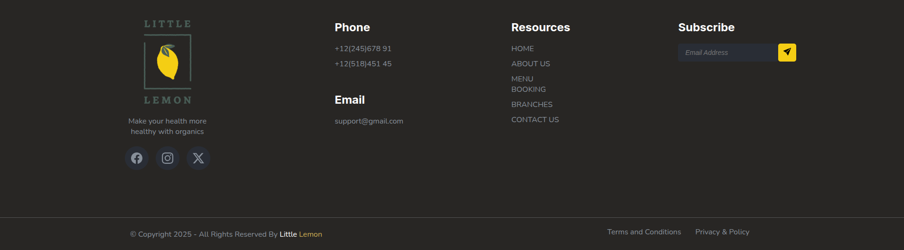

# Little Lemon Restaurant Website

## Overview
Little Lemon is a modern restaurant website created as the final project for Meta's HTML and CSS In-Depth course. This project highlights the use of advanced HTML and CSS techniques to create a visually appealing, responsive, and user-friendly restaurant website. Built with pure HTML, CSS, and Bootstrap Icons, the website offers a clean and engaging experience.

## Technologies Used

 
 
 
 
 

## Features

### 🎨 Design & Layout
- Custom-designed wave dividers using SVG
- Grid layout for menu items and location cards
- Dynamic hover effects and smooth transitions
- Consistent color palette aligned with the restaurant's brand
- Well-organized whitespace and legible typography

### 🛠 Technical Implementations
- Semantic HTML5 elements for better SEO and accessibility
- Advanced CSS properties and selectors for precise design
- Layouts using CSS Grid and Flexbox
- SVG graphics to enhance the visual appeal
- Bootstrap Icons integration for scalable vector icons
- Form validation for reservation requests
- Smooth CSS transitions and transforms for interactivity
- Google Fonts for custom typography

## Screenshots

Here are some screenshots of the Little Lemon restaurant website:

## License
This project is part of the Meta Front-End Developer Certificate coursework. Feel free to use the code as a reference for your own projects, but please credit the original work.
